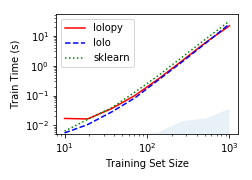
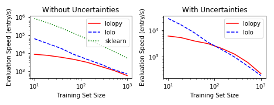

# Python Wrapper for Lolo

`lolopy` implements a Python interface to the [Lolo machine learning library](https://github.com/CitrineInformatics/lolo).

Lolo is a Scala library that contains a variety of machine learning algorithms, with a particular focus on algorithms that provide robust uncertainty estimates.
`lolopy` gives access to these algorithms as scikit-learn compatible interfaces and automatically manages the interface between Python and the JVM (i.e., you can use `lolopy` without knowing that it is running on the JVM)

## Installation

`lolopy` is available on PyPi. Install it by calling:
 
 ```
 pip install lolopy
 ```
 
 To use `lolopy`, you will also need to install Java JRE >= 1.8 on your system.
 The `lolopy` PyPi package contains the compiled `lolo` library, so it is ready to use after installation.


### Development 

Lolopy requires Python >= 3.6, Java JDK >= 1.8, and Maven to be installed on your system when developing lolopy.  

Before developing `lolopy`, compile `lolo` on your system using Maven.
We have provided a `Makefile` that contains the needed operations.
To build and install `lolopy` call `make` in this directory.

## Use

The `RandomForestRegressor` class most clearly demonstrates the use of `lolopy`.
This class is based on the [Random Forest with Jackknife-based uncertainty estimates of Wagner et al](http://jmlr.org/papers/volume15/wager14a/wager14a.pdf),
which - in effect - uses the variance between different trees in the forest to produce estimates of the uncertainty of each prediction.
Using this algorithm is as simple as using the [RandomForestRegressor from scikit-learn](https://scikit-learn.org/stable/modules/generated/sklearn.ensemble.RandomForestRegressor.html):

```python
from lolopy.learners import RandomForestRegressor

rf = RandomForestRegressor()
rf.fit(X, y)
y_pred, y_std = rf.predict(X, return_std=True)
```

The results of this code is to produce the predicted values (`y_pred`) and their uncertainties (`y_std`).

See the [`examples`](./examples) folder for more examples and details.

You may need to increase the amount of memory available to `lolopy` when using it on larger dataset sizes.
Setting the maximum memory footprint for the JVM running the machine learning calculations can be
 achieved by setting the `LOLOPY_JVM_MEMORY` environment variable.
The value for `LOLOPY_JVM_MEMORY` is used to set the maximum heap size for the JVM 
(see [Oracle's documentation for details](https://docs.oracle.com/cd/E21764_01/web.1111/e13814/jvm_tuning.htm#PERFM164)).
For example, "4g" allows `lolo` to use 4GB of memory.

## Implementation and Performance

`lolopy` is built using the [Py4J](https://www.py4j.org/) library to interface with the Lolo scala library.
Py4J provides the ability to easily managing a JVM server, create Java objects in that JVM, and call Java methods from Python. 
However, Py4J  [has slow performance in transfering large arrays](https://github.com/bartdag/py4j/issues/159).
To transfer arrays of features (e.g., training data) to the JVM before model training or evaluation, we transform the data to/from Byte arrays on the Java and Python sides. 
Transfering data as byte arrays does allow for quickly moving data between the JVM and Python but requires holding 3 copies of the data in memory at once (Python, Java Byte array, and Java numerical array).
We could reduce memory usage by passing the byte array in chunks, but this is currently not implemented.

Our performance for model training is comparable to scikit-learn, as shown in the figure below. 
The blue-shaded region in the figure represents the time required to pass training data to the JVM.
We note that training times are equivalent between using the Scala interface to Lolo and `lolopy` for training set sizes above 100.


 
Lolopy and lolo are currently slower than scikit-learn for model evaluation, as shown in the figure below.
The model timings are evaluated on a dataset size of 1000 with 145 features.
The decrease in model performance with training set size is an effect of the number of trees in the forest being equal to the training set size. 
Lolopy and lolo have similar performance for models with training set sizes of above 100.
Below a training set size of 100, the cost of sending data limits the performance of `lolopy`. 



For more details, see the [benchmarking notebook](./examples/profile/scaling-test.ipynb).
